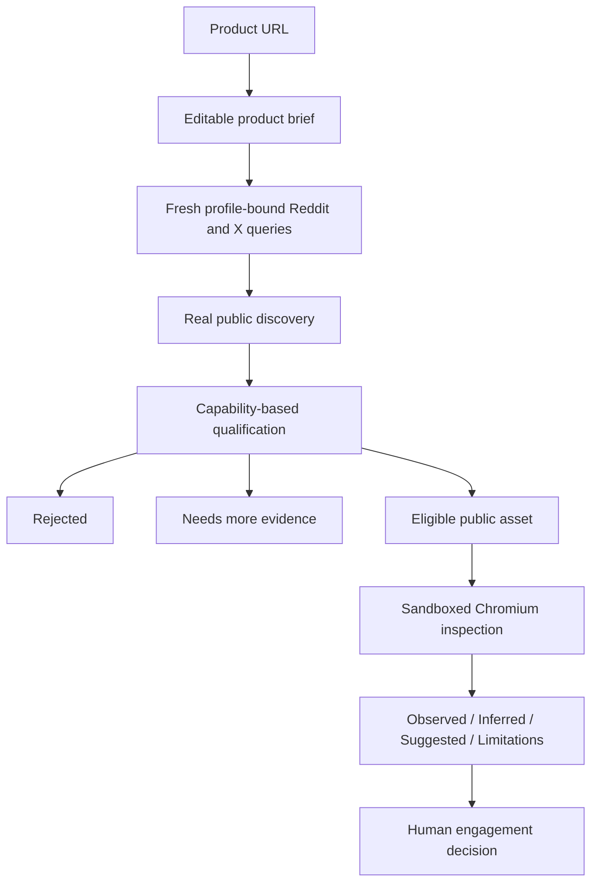

# Hallar

**Find people you can actually help. Proof before pitch.**

**[Live App](https://eca57d18247a343fe812.agent37.app)** · **[GitHub](https://github.com/Techkeyy/Hallar)**

Hallar learns what your product genuinely does, searches real public conversations for people experiencing problems it can actually solve, rejects weak matches, and checks promising opportunities against public evidence before preparing useful proof. It is a scout desk for founders and sellers who want a defensible reason to help someone before reaching out.

> “Can I genuinely help this person, and can I bring useful evidence before pitching?”

Built for the Agent37 × Monid hackathon, with OpenAI for understanding and reasoning.

## Proof before pitch

Finding a few people you can genuinely help can mean reading dozens of conversations. A relevant keyword still leaves the hard questions: does your product address the actual problem, is the problem unresolved, and what useful work can you bring?

Tools such as [Syften](https://syften.com/) monitor keywords and filter mentions. Hallar focuses on a narrower next step: connect a confirmed product capability to evidence about one prospect's problem. It does not claim to replace continuous social listening.

```text
Keyword workflow:  conversation → relevance → outreach

Hallar:            conversation → capability fit → evidence check
                                → useful proof → human decision
```

**Rejection is a feature.** Hallar prefers no lead over a fake lead. A missing public asset or unsupported proof type remains **Needs more proof**, even when the conversation sounds promising.

## Try the live app

1. Paste a public product URL.
2. Review and edit the product brief, including capabilities and boundaries.
3. Start scouting. A fresh discovery plan is generated from that confirmed brief.
4. Watch the researcher search, filter, inspect and prepare proof as those backend stages occur.
5. Read **Worth helping**, **Not a fit** and **Needs more proof** outcomes.
6. Inspect the source and decide whether to engage. Hallar never contacts anyone for you.

The current proof recipe inspects browser-grounded CSS delivery. Music and other products can be understood and searched accurately, but unsupported evidence checks remain insufficient.

## What has actually been demonstrated

| Deployed journey | Reviewed | Qualified | Rejected | Needs evidence |
|---|---:|---:|---:|---:|
| WP Rocket: documented Remove Unused CSS capability | 12 | 1 | 8 | 3 |
| FASTKEYS: song, key, chord and keyboard learning | 12 | 0 | 11 | 1 |

The WP Rocket run discovered [a real loading-time conversation](https://www.reddit.com/r/Wordpress/comments/1vbtti8/how_can_i_speed_up_the_load_time_of_my/) and inspected the author's explicitly associated public staging website. A fresh Chromium run observed blocking CSS and limited initial-view CSS rule coverage. The dossier connected that observation to the documented Remove Unused CSS capability, suggested an authorized isolated trial, and separated that suggestion from measured facts. No plugin was applied and no improvement was promised.

The FASTKEYS run used music-related discovery queries instead of inherited web-performance queries. Related but unsupported requests were rejected; plausible cases without usable proof stayed insufficient. The final source-aware validation reviewed six Reddit and six X candidates, with the same qualification rules for both.

**Source coverage:** Reddit and X public posts through inspected Monid/TikHub endpoints. There is no LinkedIn or Hacker News integration. Source sites can show login, CAPTCHA or access restrictions; the automated Reddit source-opening check reached the original URL and HTTP 200 but encountered a human-verification page.

## How it works



1. **Reads** actual public product pages and extracts capabilities with source quotations.
2. **Plans** separate Reddit and X searches from the current confirmed profile. Every query and scout job carries the same profile hash.
3. **Discovers** bounded public posts using Monid, normalizing source, author, body, original URL and associated links.
4. **Qualifies** each conversation with OpenAI against supported capabilities and evidence requirements.
5. **Inspects** up to two explicitly associated public assets with a fresh, sandboxed Chromium context.
6. **Prepares** a dossier that keeps observations, inference, suggestions and limitations distinct.

The animation follows actual application stages. There are no generated progress percentages or replayed results.

## Architecture and sponsor integrations

| Module | Responsibility |
|---|---|
| `app/ui/` | Product brief, live research stages, and proof dossiers |
| `lib/server.ts` | Isolate sessions, persist jobs, enforce budgets, and invoke Agent37 |
| `core/discovery.ts` | Generate and validate discovery plans against confirmed profile hashes |
| `worker/scout.ts` | Discover conversations, classify fit, inspect assets, and assemble results |
| `core/public-web.ts` | Validate destinations and pin public DNS through a guarded proxy |
| `core/browser.ts` | Measure a bounded public-page observation with Chromium |
| `core/provider.ts` | Request strict structured output from OpenAI |

| Integration | Load-bearing role |
|---|---|
| **Agent37** | Hosts the Next.js app and runs the scouting worker through its private execution API |
| **Monid** | Supplies real Reddit searches, Reddit reply context, and X searches through TikHub |
| **OpenAI** | Understands product pages, plans discovery, classifies fit, and reasons over measured evidence |

Removing any of these integrations breaks the demonstrated live path. Supabase is not used.

The app and worker share a private filesystem on one Agent37 instance. Session and job state lives under `.runtime/`; credentials stay in private server environment variables. The deployment exposes only application port 3000.

## Trust boundaries

- **No automatic outreach.** The human chooses whether and how to engage.
- **No forced qualification.** Unsupported capabilities and missing evidence cannot become a qualified dossier.
- **No invented observations.** Browser measurements populate Observed; model interpretation stays in Inferred and Suggested.
- **Explicit association required.** Hallar does not infer a prospect's website from an author name or profile.
- **Public destinations only.** Product fetching and browser traffic block private, reserved and metadata IP ranges, unsafe protocols, embedded credentials and non-web ports. Redirects are checked again.
- **Private runtime secrets.** Provider credentials are excluded from client bundles, browser processes, Git and logs.
- **Session isolation.** Signed HttpOnly cookies scope jobs to their originating session. New search clears that session's product and latest-result pointers.

### Checks that challenge the product

| Input or failure | Verified behavior |
|---|---|
| Previous product's query plan supplied for a new product | Profile hash mismatch rejects the plan before discovery |
| Capability or audience edited after a plan was created | Identity changes; Start scouting generates a fresh plan |
| Stored legacy queries changed | They cannot define product identity or override the fresh plan |
| Private, mapped IPv6 or metadata destination | Fetch/proxy rejects the destination |
| Forged session cookie or another session's job | New identity or inaccessible job |
| Oversized input, executable URL or duplicate capability identity | Input rejected |
| Relevant music conversation without a supported evidence recipe | Needs more proof; no fabricated qualification |
| Page refresh during or after scouting | The originating session restores the same job |

There are **three automated discovery regression tests**. Eight additional focused security checks and ten deployed browser journey checks were exercised during release validation. These are bounded checks, not a claim of complete security certification.

## Run it

**Requirements:** Node.js 24+, npm, a Chromium executable, and server-side Agent37, Monid and OpenAI credentials for live operations.

Install the locked dependencies:

```sh
git clone https://github.com/Techkeyy/Hallar.git
cd Hallar
npm ci
```

Create a private `.env.local` with your own values:

```dotenv
AGENT37_API_KEY=your_private_agent37_key
MONID_API_KEY=your_private_monid_key
OPENAI_API_KEY=your_private_openai_key
AGENT37_INSTANCE_ID=your_private_instance_id
HALLAR_ORIGIN=http://127.0.0.1:3000
HALLAR_CHROME_PATH=/usr/bin/chromium
NEXT_TELEMETRY_DISABLED=1
```

Check and run the local UI:

```sh
npm test
npm run typecheck
npm run build
npm run dev
```

Open http://127.0.0.1:3000. For Windows, point `HALLAR_CHROME_PATH` to your installed Chrome executable.

**Full scouting deployment:** run this source inside the same private Agent37 instance identified by `AGENT37_INSTANCE_ID`, at `/home/node/hallar-app`, so server and worker share `.runtime/`. Install Chromium, supply the required credential values through private runtime environment variables, set `HALLAR_ORIGIN` to the actual application origin, build, and run `npm start`. Publish only port 3000. Never upload `.env.local`. A separate local UI does not provide the shared cloud filesystem required by this version.

**Without credentials:** `npm test`, `npm run typecheck` and `npm run build` exercise the regression/build path locally. These deterministic tests use synthetic profiles, not simulated prospect results. The live app is the simplest way to try the real integration.

## Limits

- Qualified proof currently requires a documented CSS capability and usable browser evidence. Audio analysis, song transcription and general-purpose proof recipes are not implemented.
- Model judgment can be wrong. Review the capability match and original conversation yourself.
- Discovery is bounded to two Reddit queries, one X query, twelve reviewed candidates and two asset inspections per run. It is not exhaustive or continuously monitoring.
- X search is engagement-ranked; upstream does not honor chronological Latest mode. Empty results and access restrictions are possible.
- A browser observation covers one page, viewport and initial state on unthrottled desktop Chromium. It is not a physical-phone benchmark.
- CSS outside used-rule ranges may be required elsewhere. Hallar does not prove safe removal, a root cause, conversion lift or that a product will fix the issue.
- State is filesystem-backed on one host, with daily demo limits and bounded concurrency. This is a hackathon deployment, not a multi-region service.
- No automated spam, outreach, site modification or optimizer installation occurs.

The official repository starts with the current source and normal commit timestamps. No fabricated history or provider activity is claimed.

No open-source license has been declared.
